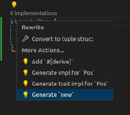

This derive macro creates a `new` associated function receiving as parameters the same fields declared in your `struct`.

So this:

```rust
#[derive(New)]
struct Cube {
	r: i32,
	c: i32,
	z: i32,
	w: i32,
}
```

... will create this:

```rust
impl Cube {
    fn new(r: i32, c: i32, z: i32, w: i32) -> Self {
        Self { r, c, z, w }
    }
}
```

ps: Rust Analyzer already generates `new` function for you!



https://rust-analyzer.github.io/manual.html#assists-code-actions

ps2: I just found (2023-11-12) another crate that already does that! =)
And it's funny that it has the same name, but swapped:
[derive-new](https://github.com/nrc/derive-new/tree/master)

It's more powerful than this one, because it handles default values, generic
struct, enums and `PhantomData`.

## Using it

https://crates.io/crates/new-derive

```
cargo add new-derive
```

```rust
use new_derive::New;

#[derive(New)]
struct Cube {
    r: i32,
    c: i32,
    z: i32,
    w: i32,
}

#[derive(Debug, New)]
struct V {
    b: Vec<String>,
}

#[derive(Debug, New)]
struct B {
    b: Box<String>,
}

#[derive(Debug, New)]
struct S1 {
    array1: [i32; 3],
    name: String,
}

#[derive(Debug, New)]
struct S2 {
    opt1: Option<String>,
    idx: usize,
    map1: std::collections::HashMap<i32, i32>,
}

fn main() {
    let cube = Cube::new(1, 2, 3, 4);
    println!("{}", cube.r * cube.c * cube.z * cube.w);

    let s1 = S1::new([1, 2, 3], "Leandro".into());
    dbg!(s1);

    let map1 = std::collections::HashMap::from([(10, 20)]);
    let s2 = S2::new(Some("ola".into()), 30, map1);
    dbg!(s2);
}
```

Output:

```
24
[src/main.rs:39] s1 = S1 {
    array1: [
        1,
        2,
        3,
    ],
    name: "Leandro",
}
[src/main.rs:43] s2 = S2 {
    opt1: Some(
        "ola",
    ),
    idx: 30,
    map1: {
        10: 20,
    },
}
```
